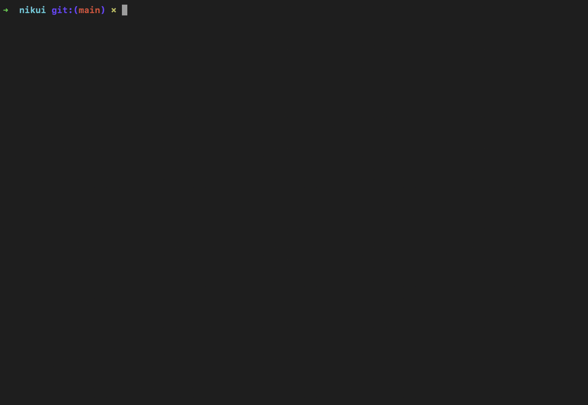

# Nikui

[](LICENSE)
[](https://www.python.org/)
[](https://github.com/Blue-Bear-Security/nikui/actions)
[](https://github.com/psf/black)



**Stop guessing where your technical debt is.** Nikui combines LLM semantic reasoning with Git churn to prioritize exactly which files are rotting and need your attention.

**Nikui** is a code smell and technical debt analyzer that produces a prioritized hotspot report by combining LLM semantic analysis, static security scanning, structural duplication detection, and objective code metrics.

## Example Output

See [`examples/`](examples/) for a real scan of the Nikui codebase itself:
- [`nikui_self_scan.json`](examples/nikui_self_scan.json) — raw findings
- [`nikui_self_scan.html`](examples/nikui_self_scan.html) — interactive report
- [`config.json`](examples/config.json) — config used for the scan (Ollama, Qwen2.5-Coder-7B)

## Features

- **LLM Semantic Analysis:** Detects SOLID violations, silent failures, god objects, and other deep structural issues. Works with any OpenAI-compatible backend (OpenAI, MLX, LM Studio, Ollama).
- **Static Security Scan:** Comprehensive security and best-practice analysis via Semgrep.
- **Verified Duplication:** Two-tier structural detection using Simhash candidates verified by LLM to eliminate noise.
- **Objective Metrics:** Complexity scores, oversized files, and debug log detection via Flake8.
- **Hotspot Matrix:** Prioritizes findings using `Stench × Churn` — a complex file that changes frequently ranks higher than a smelly file no one touches.
- **Interactive Report:** Sortable HTML report with expandable findings per file.

## Setup

### 1. Install Dependencies
```bash
# Install uv if you haven't
curl -LsSf https://astral.sh/uv/install.sh | sh

uv sync
```

### 2. Create Your Config

To customize Nikui for a repo, create a `.nikui/config.json` inside it:
```bash
mkdir .nikui
cp /path/to/nikui/examples/config.json .nikui/config.json
```

Nikui looks for `.nikui/config.json` in the target repo and falls back to sensible bundled defaults if none is found.

### 3. Configure an LLM Backend

Nikui works with any **OpenAI-compatible** LLM server. Set `base_url` and `model` in `config.json`.

#### Option A: OpenAI (fastest — recommended for large repos)
```json
"ollama": {
  "base_url": "https://api.openai.com/v1",
  "model": "gpt-4.1-mini",
  "workers": 4
}
```
Set your key as an environment variable — **never put it in `config.json`**:
```bash
export OPENAI_API_KEY=sk-...
```

#### Option B: MLX (Apple Silicon)
```bash
pip install mlx-lm
mlx_lm.server --model mlx-community/Qwen2.5-Coder-14B-Instruct-4bit --port 8080
```
```json
"ollama": {
  "base_url": "http://localhost:8080/v1",
  "model": "mlx-community/Qwen2.5-Coder-14B-Instruct-4bit"
}
```

#### Option C: LM Studio (Windows / Linux / Mac)
Download [LM Studio](https://lmstudio.ai), load a model, and start the local server (default port 1234).
```json
"ollama": {
  "base_url": "http://localhost:1234/v1",
  "model": "qwen2.5-coder-14b-instruct"
}
```

#### Option D: Ollama
```bash
ollama pull qwen2.5-coder:14b
ollama serve
```
```json
"ollama": {
  "base_url": "http://localhost:11434/v1",
  "model": "qwen2.5-coder:14b"
}
```

> **LLM is optional.** If no backend is running, the semantic analysis and duplication verification stages are skipped gracefully.

## Usage

```bash
# Full scan
uv run nikui smell <repo_path>

# Targeted scan (specific engines only)
uv run nikui smell <repo_path> --stages duplication semgrep

# Diff mode: Analyze only changed files since a base branch (CI optimization)
uv run nikui smell <repo_path> --diff origin/main

# Save to a specific output file
uv run nikui smell <repo_path> --output my_scan.json

# Generate HTML report from the latest scan
uv run nikui report <repo_path>
```

## GitHub Action & CI/CD: The "Stench Guard"

Nikui is designed for CI/CD with its **Diff-Aware** scanning mode. Instead of scanning the entire repo on every PR, Nikui can focus exclusively on the delta.

### Key CI Features:
- **`--diff <base>`**: Only runs semantic, security, and metric analysis on modified files.
- **Stateful Duplication**: Caches Simhashes in `.nikui/fingerprints.json` to detect if new code is a clone of existing code without re-indexing the whole repo.
- **Delta Prioritization**: Focuses LLM reasoning on changed code to keep CI fast and costs low.

See [**`examples/nikui_gh_action.yml`**](examples/nikui_gh_action.yml) for a production-ready GitHub Action template.

## How It Works: The Hotspot Matrix

`Hotspot Score = Stench × Churn`

- **Stench:** Weighted sum of all findings in a file. Weights are configurable in `config.json` (e.g., Security = 50, Architectural Flaw = 20).
- **Churn:** Number of times the file has been modified in Git history.
- **Result:** Files classified into quadrants — Toxic, Frozen, Quick Win, or Healthy.

## Configuration

- **`config.json`** — exclusion patterns, LLM settings, Semgrep rulesets, Flake8 ignores, stench weights
- **`nikui/prompts/`** — LLM rubrics for smell detection and duplication verification
- **`nikui_results/`** — all scans and reports saved automatically with timestamps

## Prior Art & References

Nikui is built on the shoulders of giants in the software forensics and maintainability space:

- **Hotspot Analysis:** Based on [Adam Tornhill's](https://adamtornhill.com/) work in *"Your Code as a Crime Scene"*, specifically the methodology of combining logical coupling (churn) with technical debt (stench) to identify high-risk areas.
- **Code Smells:** Inspired by [Michael Feathers](https://michaelfeathers.silvrback.com/) (*"Working Effectively with Legacy Code"*) and [Robert C. Martin](http://cleancoder.com/) (*"Clean Code"*).
- **Structural Duplication:** Utilizes the [Simhash](https://en.wikipedia.org/wiki/SimHash) algorithm (Charikar, 2002) for high-performance near-duplicate detection, verified via LLM semantic analysis.
- **Static Analysis:** Powered by [Semgrep](https://semgrep.dev/) for security-focused pattern matching.

## Contributing

Contributions are welcome. To get started:

1. Fork the repo and create a branch
2. Install dependencies: `uv sync`
3. Run tests before and after your change: `uv run pytest`
4. Run the linter: `uv run flake8 nikui/`
5. Open a pull request with a clear description of what you changed and why

Good areas to contribute:
- New smell detection engines
- Prompt improvements (`nikui/prompts/`)
- Support for additional languages in the dependency engine
- Report UI enhancements (`nikui/report_template.html`)

## License

Apache 2.0 — see [LICENSE](LICENSE)

---
Created by [**amirshk**](https://github.com/amirshk)
